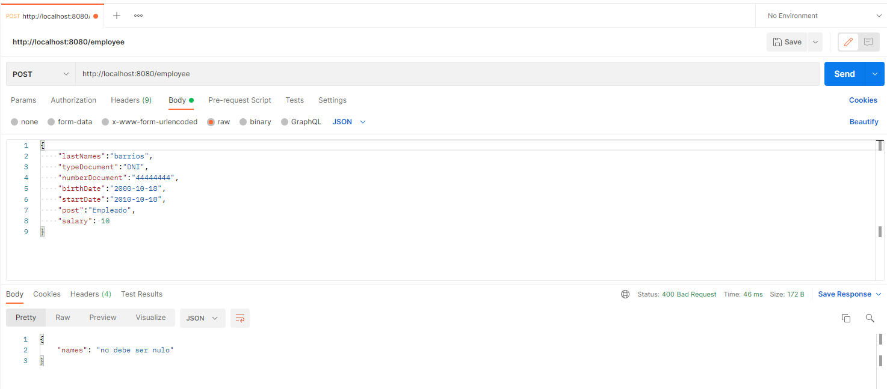
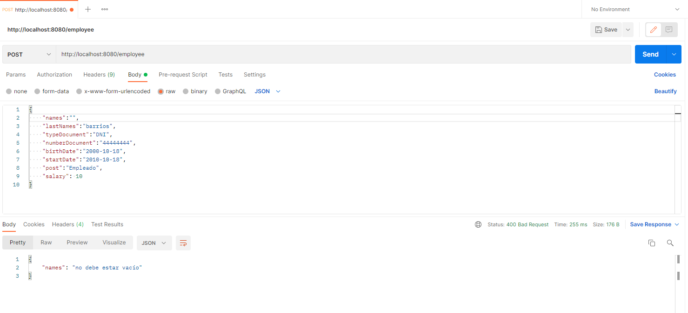

# Técnico Parameta
Examen Técnico Parameta

## Run Project

mvn spring-boot:run (IntelliJ IDE)

## Build Project

Ctrl + F9. Click derecho en la carpeta de proyecto, pinchar en la opcion build module.

## Base Datos

Crear una base de datos MySQL con el nombre parametra (CAMBIAR)

## Pruebas Con PostMan 

Empleado creado

Validación campo NotNull

Validación campo Vacio

Validación de edad

Validación de fecha

Validación de salario

