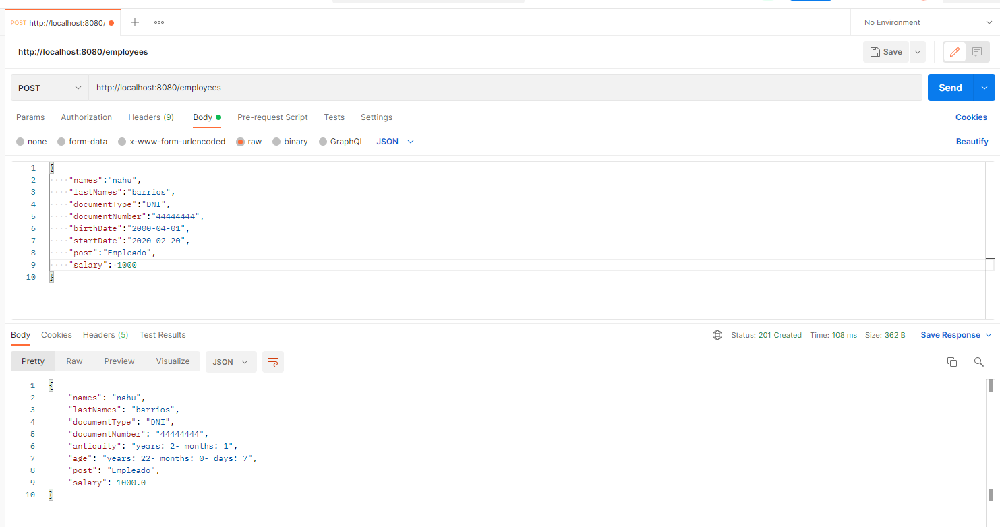
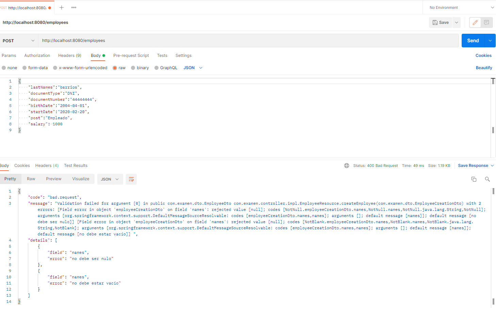
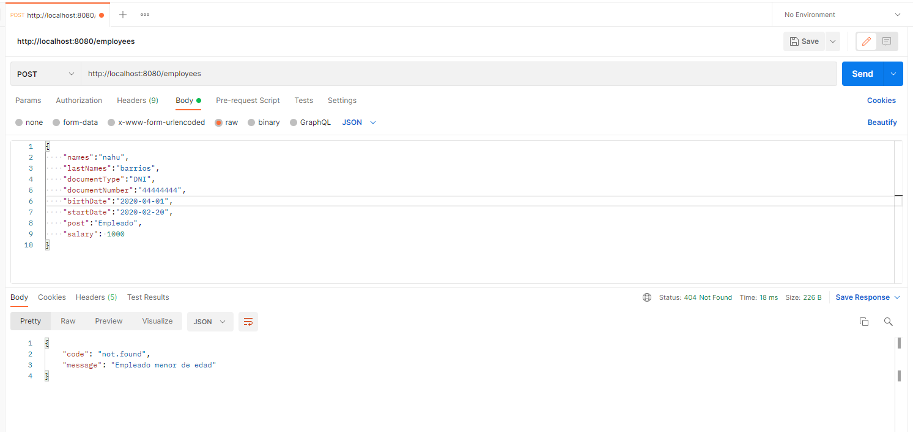
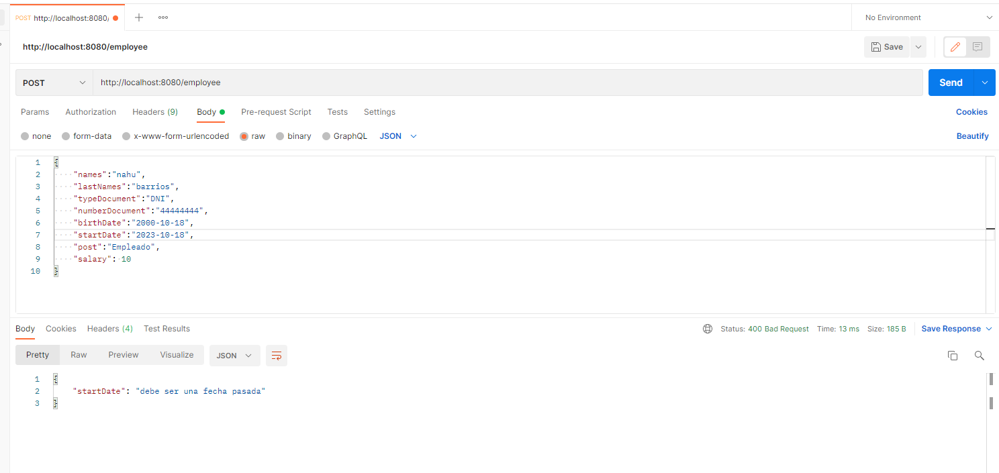
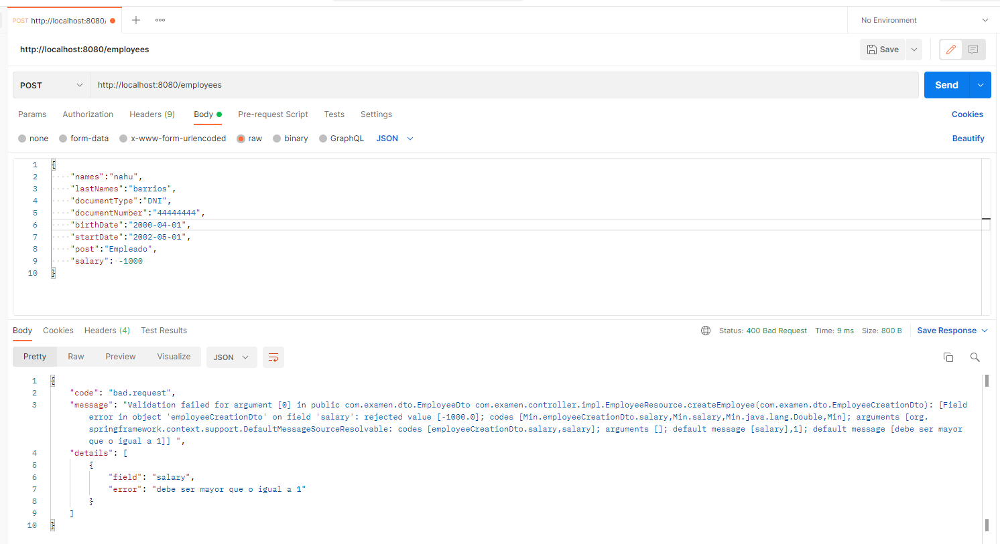

# Técnico Parameta
Examen Técnico Parameta

## Run Project

mvn spring-boot:run

## Build Project

mvn clean install

## Base Datos

Crear una base de datos MySQL con el nombre parameta

## Run Test

mvn test

## Pruebas Con PostMan 

Empleado creado

Validación campo NotNull y campo Vacio

Validación de edad

Validación de fecha

Validación de salario

